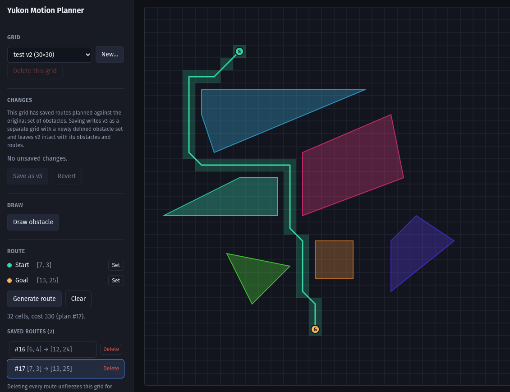

# Yukon Motion Planner

## Overview

Yukon Motion Planner is a platform to build and evaluate motion planning algorithms. There is a frontend to visualize
and edit the environment, and to visually validate the planning performance. The backend implements the planning engine,
stores the environment and planning results, and exposes an API for the frontend to interact with.

Backend built in Rust, using Axum/SeaORM/Postgres. Frontend built in React/TypeScript, using Vite.

## Instructions

* Install Rust and Node.js (with pnpm) if you don't have them already.
* Run `pnpm install` in the `frontend` directory to install frontend dependencies.
* Run `cargo build` in the root directory to build the backend.
* Run `docker compose up` in the root directory to start a Postgres database.'
* Run `cargo run` in the root directory to start the backend server.
* Run `pnpm run dev` in the `frontend` directory to start the frontend server.

# In Progress

* More planning algorithms (only A* and D*Lite for now)
* Moving/Varying obstacles and Temporal planning
* Actuator Dynamics
* Uncertainty modeling
* 3D planning
* Host the backend